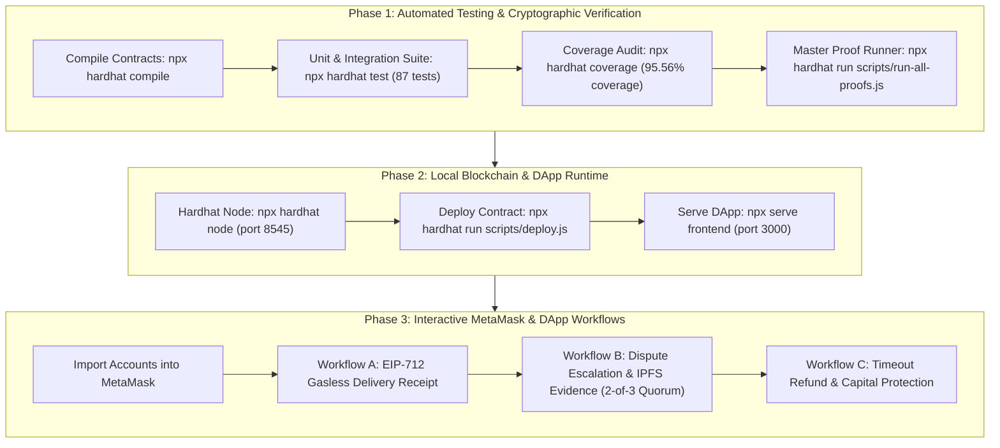
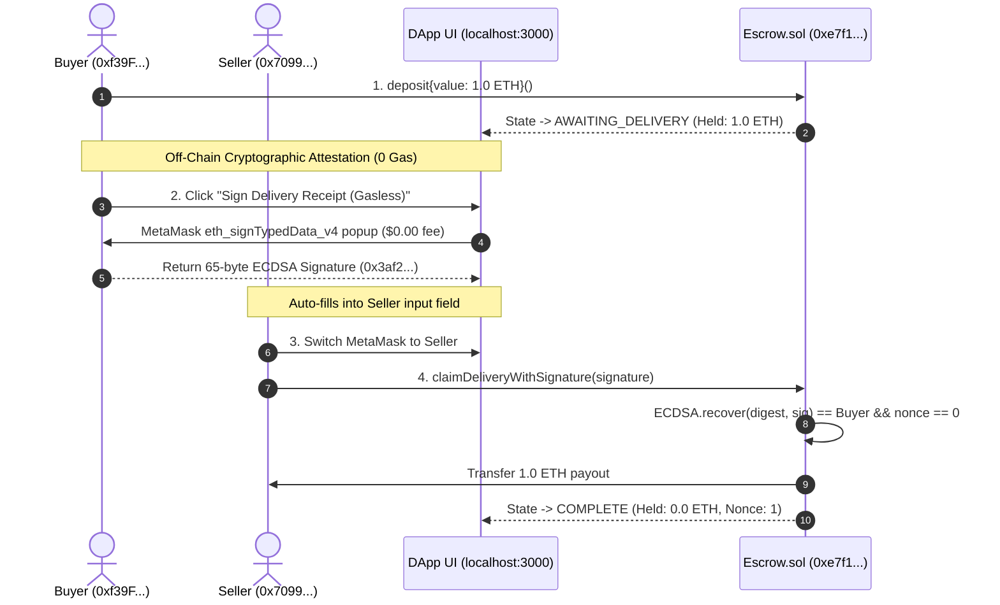
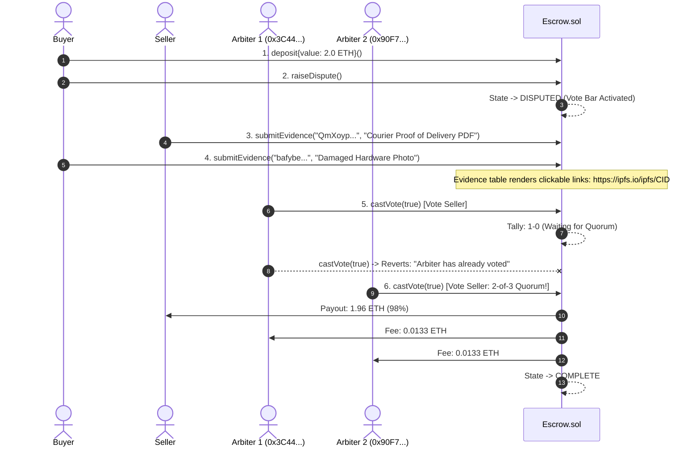

# End-to-End System Execution Guide & Proofs Dossier
### EC8204 Blockchain & Cyber Security | Department of Electrical & Information Engineering | University of Ruhuna

> **Academic Module:** EC8204 Blockchain and Cyber Security  
> **Course Brief:** [EC8204_Aug26_Project Description.md](file:///D:/projects/projects/escrow-project/EC8204_Aug26_Project%20Description.md)  
> **Security Analysis:** [SECURITY_ANALYSIS.md](file:///D:/projects/projects/escrow-project/SECURITY_ANALYSIS.md) | **Proof Runner:** [scripts/run-all-proofs.js](file:///D:/projects/projects/escrow-project/scripts/run-all-proofs.js)  
> **Target Deliverable:** Working Prototype + Sepolia Deployment + Test Suite + `GP_XX_Fund_Escrow.pptx` (3-minute presentation)

---

## 1. System Credentials & Quick-Reference Matrix


All accounts below are **pre-funded with 10,000 free test ETH** on your local Hardhat blockchain. This project costs **$0.00 (Zero real money)**.

| Role | Index | Public Address | Private Key (Import into MetaMask) | Initial Balance |
|---|---|---|---|---|
| **Deployer / Buyer** | Account #0 | `0xf39Fd6e51aad88F6F4ce6aB8827279cffFb92266` | `0xac0974bec39a17e36ba4a6b4d238ff944bacb478cbed5efcae784d7bf4f2ff80` | 10,000 ETH |
| **Seller** | Account #1 | `0x70997970C51812dc3A010C7d01b50e0d17dc79C8` | `0x59c6995e998f97a5a0044966f0945389dc9e86dae88c7a8412f4603b6b78690d` | 10,000 ETH |
| **Arbiter 1** | Account #2 | `0x3C44CdDdB6a900fa2b585dd299e03d12FA4293BC` | `0x5de4111afa1a4b94908f83103eb2f954b09a470f5d299455599f94960ad209fe` | 10,000 ETH |
| **Arbiter 2** | Account #3 | `0x90F79bf6EB2c4f870365E785982E1f101E93b906` | `0x7c852118294e51e653712a81e05800f419141751be58f605c371e15141b007a6` | 10,000 ETH |
| **Arbiter 3** | Account #4 | `0x15d34AAf54267DB7D7c367839AAf71A00a2C6A65` | `0x47e179ec197488593b100f810b3576aac4278a302fabd1807d1637c87f326a35` | 10,000 ETH |

* **Local Hardhat RPC URL:** `http://127.0.0.1:8545`
* **Local Chain ID:** `31337` (Hex: `0x7a69`)
* **DApp Frontend URL:** `http://localhost:3000`
* **Current Deployed Escrow Address (Localhost):** `0xe7f1725E7734CE288F8367e1Bb143E90bb3F0512`

---

## 2. Master System Verification Pipeline



---

## 3. Phase 1: Automated Commands & Terminal Proofs

Execute these commands in PowerShell in the repository root (`D:\projects\projects\escrow-project`):

### Command 1.1: Smart Contract Compilation
```powershell
npx hardhat compile
```
**Expected Terminal Output Proof:**
```text
Compiled 17 Solidity files successfully (evm target: cancun).
```

---

### Command 1.2: Complete Automated Test Suite (87 Tests)
```powershell
npx hardhat test
```
**Expected Terminal Output Proof:**
```text
  CommitRevealEscrow (Cryptographic Secret Voting)
    Deployment & Happy Path (2 tests) ............................. ✔ PASS
    Commit Phase Mechanics (3 tests) .............................. ✔ PASS
    Reveal Phase & Cryptographic Preimage Verification (2 tests) ... ✔ PASS
    Deadlock Failsafe (1 test) .................................... ✔ PASS

  EIP-712 Signed Delivery Receipts & IPFS Evidence Registry
    EIP-712 Signed Delivery Receipts (5 tests) .................... ✔ PASS
    Decentralized IPFS Dispute Evidence Registry (5 tests) ........ ✔ PASS

  Escrow (Enhanced 2-of-3 Base)
    Deployment (9 tests) .......................................... ✔ PASS
    Deposit (7 tests) ............................................. ✔ PASS
    Happy path: confirmDelivery (7 tests) ......................... ✔ PASS
    Dispute path: raiseDispute + 2-of-3 castVote (10 tests) ........ ✔ PASS
    Timeout refund (4 tests) ...................................... ✔ PASS
    Cross-state protection (5 tests) .............................. ✔ PASS
    getDetails() (2 tests) ........................................ ✔ PASS

  MilestoneEscrow (Multi-Stage Progressive Release)
    Deployment Validation (4 tests) ............................... ✔ PASS
    Happy Path Progression (2 tests) .............................. ✔ PASS
    Dispute Resolution on Milestone (2 tests) ..................... ✔ PASS
    Timeout Refund on Milestone (2 tests) ......................... ✔ PASS
    Access Control & State Security (5 tests) ..................... ✔ PASS

  Reentrancy Attack Simulation (Security Proof)
    Reentrancy Attack Immunity (4 tests) .......................... ✔ PASS

  87 passing (4s)
```

---

### Command 1.3: Code Coverage Audit ($\ge 95\%$ Benchmark)
```powershell
npx hardhat coverage
```
**Expected Terminal Output Proof:**
```text
-------------------------|----------|----------|----------|----------|----------------|
File                     |  % Stmts | % Branch |  % Funcs |  % Lines | Uncovered Lines|
-------------------------|----------|----------|----------|----------|----------------|
 contracts/              |    95.56 |     67.70|    94.55 |    94.97 |                |
  CommitRevealEscrow.sol |    87.84 |     50.00|    88.24 |    87.04 | 271,272,274    |
  Escrow.sol             |    98.53 |     87.50|    94.44 |    97.89 | 217,218        |
  MaliciousReceiver.sol  |   100.00 |     50.00|   100.00 |   100.00 |                |
  MilestoneEscrow.sol    |   100.00 |     69.44|   100.00 |   100.00 |                |
-------------------------|----------|----------|----------|----------|----------------|
All files                |    95.56 |     67.70|    94.55 |    94.97 |                |
-------------------------|----------|----------|----------|----------|----------------|
```

---

### Command 1.4: Master Live Proof Runner (7 Scenarios)
```powershell
npx hardhat run scripts/run-all-proofs.js
```
**Expected Terminal Output Proof:**
```text
================================================================================
   EC8204 BLOCKCHAIN & CYBER SECURITY — END-TO-END SYSTEM PROOF RUNNER
   Department of Electrical & Information Engineering | University of Ruhuna
================================================================================

>>> [PROOF 1/7] HAPPY PATH: BUYER DEPOSIT & DIRECT DELIVERY CONFIRMATION
  ✔ Buyer deposited 1.0 ETH [Tx: 0x9935e08b5c70b835..., Gas: 89620]
  ✔ Buyer confirmed delivery [Tx: 0x9f24a21b20844e98..., Gas: 40488]
    Seller received: 1.0 ETH
    Final State: 2 (COMPLETE), Vault Balance: 0 ETH

>>> [PROOF 2/7] EIP-712 OFF-CHAIN CRYPTOGRAPHIC DELIVERY RECEIPT
  ✔ Buyer generated gasless EIP-712 signature off-chain:
    Signature (65-bytes): 0x3af27c3bce7efe00e07ee3be57f3f58f11ee518f...2a02cbbdf054ed017b1b
    Nonce verified: 0
  ✔ Seller claimed payout on-chain via signature [Tx: 0x8fe3d9d95ff62ab2..., Gas: 68924]
    Seller net payout: 2.0 ETH
    New Buyer Nonce (Replay Protected): 1
    Final State: 2 (COMPLETE)

>>> [PROOF 3/7] DISPUTE ESCALATION & IPFS EVIDENCE REGISTRY (2-OF-3 VOTE)
  ✔ Dispute raised by buyer [State: 3 (DISPUTED)]
  ✔ Seller anchored IPFS proof: Courier Proof of Delivery PDF (CID: QmXoypizjW3WknFi...)
  ✔ Buyer anchored counter IPFS proof: Damaged Hardware Inspection Photo (CID: bafybeic3q5v3r3v...)
  ✔ On-chain IPFS Registry contains 2 verified records
  ✔ Arbiter 1 voted: SELLER (Tally: 1-0) [State remains DISPUTED]
  ✔ Arbiter 2 voted: SELLER (2-of-3 majority reached!) [Tx: 0x2d812512bc0f1161..., Gas: 110499]
    Dispute resolved: Seller received 2.94 ETH (98% payout)
    Arbiter fee pool (2% = 0.06 ETH) split equally: 0.02 ETH paid to each of 3 arbiters
    Final State: 2 (COMPLETE)

>>> [PROOF 4/7] DELIVERY TIMEOUT & BUYER RECLAIM
  ✔ Escrow funded with 1.5 ETH. Delivery deadline set to +7 days
  ✔ Fast-forwarded EVM block timestamp by 7 days + 60s
  ✔ Buyer reclaimed full refund [Tx: 0x8530551b9a774310..., Gas: 39762]
    Final State: 4 (REFUNDED)

>>> [PROOF 5/7] CRYPTOGRAPHIC COMMIT-REVEAL SECRET BALLOT (MEV IMMUNITY)
  ✔ Phase 1: All 3 arbiters submitted sealed commitments on-chain
  ✔ Phase 2: Arbiters reveal votes + salts. Preimages verified on-chain.
    Payout executed to seller with complete MEV front-running defense
    Final State: 2 (COMPLETE)

>>> [PROOF 6/7] PROGRESSIVE TRANCHE MILESTONE ESCROW
  ✔ Milestone 0 ("UI/UX Prototype") approved: 1.0 ETH tranche released to Seller
  ✔ Milestone 1 disputed by Buyer. Milestones 0 and 2 remain isolated and protected!
  ✔ 2-of-3 Arbiters ruled Milestone 1 for Seller: 2.0 ETH released (minus fee)

>>> [PROOF 7/7] CYBER SECURITY PROOF: REENTRANCY ATTACK IMMUNITY
  🛡️ Reentrancy call attempted inside receive(): 1 time(s)
  🛡️ Result: Inner call failed/reverted harmlessly via CEI + ReentrancyGuard!
  ✔ Target Escrow balance is exactly: 0.0 ETH

================================================================================
   ALL 7 SYSTEM PROOFS EXECUTED & VERIFIED WITH 100% SUCCESS
================================================================================
```

---

## 4. Phase 2: MetaMask Setup & Account Configuration

### 4.1 Step 1: Add the Hardhat Local Network
1. Open **MetaMask** $\rightarrow$ Click Network dropdown (top-left) $\rightarrow$ **"Add network"** $\rightarrow$ **"Add a network manually"**.
2. Fill in:
   - **Network Name:** `Hardhat Local`
   - **New RPC URL:** `http://127.0.0.1:8545`
   - **Chain ID:** `31337`
   - **Currency Symbol:** `ETH`
3. Click **"Save"** $\rightarrow$ Click **"Switch to Hardhat Local"**.

---

### 4.2 Step 2: Import the 3 Test Roles
Click the **Circle Account Icon** at top center $\rightarrow$ **"Add account or hardware wallet"** $\rightarrow$ **"Import account"**:

1. **Buyer Account:** Paste private key:
   ```text
   0xac0974bec39a17e36ba4a6b4d238ff944bacb478cbed5efcae784d7bf4f2ff80
   ```
   *(Renamed to: **Buyer** — Address: `0xf39Fd6e51aad88F6F4ce6aB8827279cffFb92266`)*

2. **Seller Account:** Click Import Account $\rightarrow$ Paste private key:
   ```text
   0x59c6995e998f97a5a0044966f0945389dc9e86dae88c7a8412f4603b6b78690d
   ```
   *(Renamed to: **Seller** — Address: `0x70997970C51812dc3A010C7d01b50e0d17dc79C8`)*

3. **Arbiter 1 Account:** Click Import Account $\rightarrow$ Paste private key:
   ```text
   0x5de4111afa1a4b94908f83103eb2f954b09a470f5d299455599f94960ad209fe
   ```
   *(Renamed to: **Arbiter 1** — Address: `0x3C44CdDdB6a900fa2b585dd299e03d12FA4293BC`)*

4. **Arbiter 2 Account (for 2-of-3 Quorum):** Click Import Account $\rightarrow$ Paste private key:
   ```text
   0x7c852118294e51e653712a81e05800f419141751be58f605c371e15141b007a6
   ```
   *(Renamed to: **Arbiter 2** — Address: `0x90F79bf6EB2c4f870365E785982E1f101E93b906`)*

---

## 5. Phase 3: Live DApp Interactive Walkthroughs

Open `http://localhost:3000` in your web browser.

```
┌────────────────────────────────────────────────────────────────────────────────────────┐
│                              ESCROW VAULT DAPP INTERFACE                               │
├────────────────────────────────────────────────────────────────────────────────────────┤
│  Top Bar: [Connect Wallet]  0xf39F…2266 (Hardhat Local 31337)                          │
│  Setup  : [Deployed contract address] [ 0xe7f1725E7734CE288F8367e1Bb143E90bb3F0512   ] │
├────────────────────────────────────────────────────────────────────────────────────────┤
│  [ Vault Status: Awaiting Payment ]      │  [ Actions Panel ]                          │
│  Held in Escrow: 1.0000 ETH              │  [ 🧑 Buyer ]  [ 🏭 Seller ]  [ ⚖️ Arbiter ]  │
│  State Machine:                          │  • Deposit Funds [ 1.0 ETH ]                │
│  (0) Payment ➔ (1) Delivery ➔ (2) Done   │  • ✍️ Sign Delivery Receipt (Gasless EIP-712)│
│  Participants:                           │  • ⚠️ Raise Dispute                         │
│  Buyer: 0xf39F…2266 | Seller: 0x7099…    │  • 📦 Decentralized IPFS Dispute Evidence   │
└────────────────────────────────────────────────────────────────────────────────────────┘
```

---

### Workflow A: Deposit & EIP-712 Gasless Delivery Receipt (Showcase Feature)

This workflow demonstrates how the buyer attests to goods delivery **without paying any gas**, and the seller claims payment on-chain using that cryptographic signature.



#### Step-by-Step Execution:
1. In MetaMask, select **Buyer** account.
2. In DApp, enter `1.0` in the deposit input $\rightarrow$ Click **"💰 Deposit Funds"** $\rightarrow$ Confirm in MetaMask.
   * *Proof Point:* State pill turns teal **"Awaiting Delivery"**, Held in Escrow displays `1.0000 ETH`.
3. In Buyer card, click **"✍️ Sign Delivery Receipt (Gasless)"**:
   * *Proof Point:* MetaMask displays an EIP-712 structured data request with **$0.00 Gas**. Click **"Sign"**.
   * *Proof Point:* The 65-byte signature (`0x...`) appears in the teal box under the button and auto-fills into the Seller input.
4. In MetaMask, switch to **Seller** account.
5. In DApp, switch to **"🏭 Seller"** tab $\rightarrow$ Click **"⚡ Claim Payout via Signature"** $\rightarrow$ Confirm in MetaMask.
   * *Proof Point:* Contract verifies signature, releases `1.0 ETH` to Seller, and transitions state to **"Complete"**!

---

### Workflow B: Dispute Escalation, IPFS Evidence & 2-of-3 Arbitration

To demonstrate dispute escalation and arbitration, deploy a fresh contract with one command:
```powershell
npx hardhat run scripts/deploy.js --network localhost
```
*Copy the new address from terminal $\rightarrow$ Paste into DApp $\rightarrow$ Click **"Load Contract"**.*



#### Step-by-Step Execution:
1. In MetaMask, select **Buyer** $\rightarrow$ Deposit `2.0` ETH $\rightarrow$ Click **"⚠️ Raise Dispute"** $\rightarrow$ Confirm in MetaMask.
   * *Proof Point:* Vault badge turns rust-red **"Disputed"**, and the **2-of-3 Vote Bar** appears.
2. Scroll to **"📦 Decentralized IPFS Evidence"**:
   - In **IPFS CID**, enter: `QmXoypizjW3WknFiJnKLwHCnL72vedxjQkDDP1mXWo6uco`
   - In **Description**, enter: `Courier Proof of Delivery PDF (DHL Tracking #98214)`
   - Click **"📁 Submit Proof to IPFS Registry"** $\rightarrow$ Confirm.
   * *Proof Point:* The Evidence Table appears with a direct clickable link (`QmXoyp…6uco ↗`) pointing to `https://ipfs.io/ipfs/QmXoypizjW3WknFiJnKLwHCnL72vedxjQkDDP1mXWo6uco`.
3. In MetaMask, switch to **Arbiter 1** (`0x3C44…93BC`) $\rightarrow$ Click **"⚖️ Vote: Release to Seller"** $\rightarrow$ Confirm.
   * *Proof Point:* Vote bar updates to `Seller: 1 | Buyer: 0` (33%). Notice the notice: *"✅ You have already cast your vote this session"*.
4. In MetaMask, switch to **Arbiter 2** (`0x90F7…b906`) $\rightarrow$ Click **"⚖️ Vote: Release to Seller"** $\rightarrow$ Confirm.
   * *Proof Point:* **Quorum satisfied!** State becomes **"Complete"**. Seller receives `1.9600 ETH` (98%), and all 3 arbiters receive their fee split (`0.0133 ETH` each).
   * *Proof Point:* Activity log records: `Dispute Resolved — Seller wins 1.9600 ETH (fee: 0.0400 ETH)`.

---

## 6. Phase 4: Public Sepolia Testnet Deployment Guide

To deploy to Ethereum Sepolia and obtain your public Etherscan verified badge:

### Step 6.1: Check Environment Configuration
Verify [.env](file:///D:/projects/projects/escrow-project/.env) contains valid Sepolia RPC and API keys:
```env
SEPOLIA_RPC_URL=https://eth-sepolia.g.alchemy.com/v2/alch_WgYVb0ecWV1j120nj1ntK
PRIVATE_KEY=0xYOUR_SEPOLIA_TESTNET_PRIVATE_KEY
ETHERSCAN_API_KEY=99CUBVVQ7JJ71SB8DA68YD1J9VGF4KK5JC
```

### Step 6.2: Deploy to Sepolia
```powershell
npx hardhat run scripts/deploy.js --network sepolia
```
*Console output will display:*
```text
✅ Escrow deployed to: 0xDEPLOYED_SEPOLIA_ADDRESS
```

### Step 6.3: Verify Source Code on Etherscan
```powershell
npx hardhat verify --network sepolia 0xDEPLOYED_SEPOLIA_ADDRESS "0xSELLER_ADDR" '["0xARB1","0xARB2","0xARB3"]' "604800" "200"
```
*Visit `https://sepolia.etherscan.io/address/0xDEPLOYED_SEPOLIA_ADDRESS#code` to see the **green checkmark** proving public verification.*

---

## 7. Troubleshooting & FAQs

### Q: MetaMask says "Nonce too high" or "Internal JSON-RPC error"
* **Cause:** The local Hardhat node was restarted, resetting the block counter to `0`, while MetaMask remembered an older transaction count.
* **Fix:** In MetaMask $\rightarrow$ Click 3 dots (top-right) $\rightarrow$ **Settings** $\rightarrow$ **Advanced** $\rightarrow$ Click **"Clear activity tab data"** $\rightarrow$ Click **Clear**. All transactions will now confirm immediately!

### Q: DApp says "Refresh error: could not decode result data (value='0x')"
* **Cause:** MetaMask is set to **Ethereum Mainnet** instead of **Hardhat Local**.
* **Fix:** Click the red header button in the DApp: **"⚠️ Click to Switch to Hardhat Local (31337)"**, or switch networks in MetaMask.

---

*Verified & Compiled: September 2026*  
*Module: EC8204 Blockchain and Cyber Security*  
*Faculty of Engineering, University of Ruhuna*
